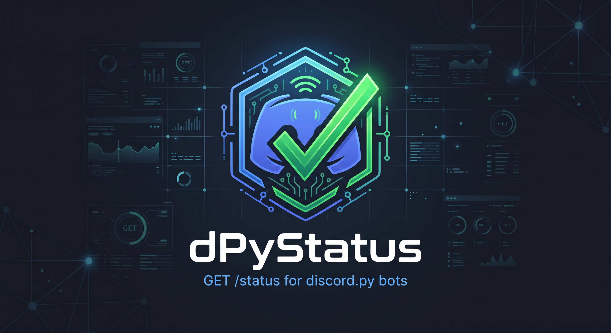

<div align="center">
  

  # dPyStatus

  **A lightweight `GET /status` HTTP endpoint for discord.py bots.**

  [](LICENSE)
  [](https://www.python.org/)
  [](https://github.com/Rapptz/discord.py)
</div>

## 📋 • Table of Contents

- [📖 • Overview](#--overview)
- [📦 • Installation](#--installation)
- [🚀 • Usage](#--usage)
  - [As an extension](#as-an-extension-configured-through-environment-variables)
  - [As a cog](#as-a-cog-explicit-options)
  - [Standalone](#standalone)
  - [Extra values](#extra-values)
  - [Examples](#examples)
- [📡 • Response](#--response)
- [💻 • Development](#--development)
- [🏭 • Used in production](#--used-in-production)
- [🙌 • Credits](#--credits)
- [📄 • License](#--license)

## 📖 • Overview

dPyStatus runs an [aiohttp](https://docs.aiohttp.org) server inside the bot's own event loop (no thread, no extra
dependency: aiohttp already ships with [discord.py](https://github.com/Rapptz/discord.py)) and exposes the bot's stats
as JSON, so an external service can tell whether the bot is online.

Key features:
- A single `GET /status` route answering `200` when the bot is ready, `503` when it is not
- Shard-aware: per-shard latency, guild count and connection state
- Optional bearer token authentication
- Your own values exposed under `extra`, from sync or async callbacks
- Three ways to plug it in: extension, cog or standalone server

## 📦 • Installation

```sh
uv add git+https://github.com/PaulBayfield/dPyStatus
```

## 🚀 • Usage

### As an extension (configured through environment variables)

```python
await bot.load_extension("dPyStatus.extension")
```

| Variable               | Default     | Description                                                 |
| ---------------------- | ----------- | ----------------------------------------------------------- |
| `DPYSTATUS_HOST`       | `127.0.0.1` | Interface to bind. Use `0.0.0.0` in Docker.                 |
| `DPYSTATUS_PORT`       | `8080`      | Port to listen on.                                          |
| `DPYSTATUS_PATH`       | `/status`   | Route of the endpoint.                                      |
| `DPYSTATUS_TOKEN`      | _none_      | If set, requests must send `Authorization: Bearer <token>`. |
| `DPYSTATUS_ACCESS_LOG` | `false`     | Log every request.                                          |

### As a cog (explicit options)

```python
from dPyStatus import StatusCog


class MyBot(commands.Bot):
    async def setup_hook(self) -> None:
        await self.add_cog(StatusCog(self, host="0.0.0.0", port=8080, token="secret"))
```

The server starts when the cog is loaded and stops when it is unloaded or when the bot closes.

### Standalone

```python
from dPyStatus import StatusServer


class MyBot(commands.Bot):
    async def setup_hook(self) -> None:
        self.status = StatusServer(self, host="0.0.0.0", port=8080)
        await self.status.start()

    async def close(self) -> None:
        await self.status.stop()
        await super().close()
```

`StatusServer` is also an async context manager (`async with StatusServer(bot): ...`), and works with a plain
`discord.Client` or `discord.AutoShardedClient` too.

### Extra values

Expose your own values under `extra`. Callbacks take no argument, may be sync or async, and must return something
JSON-serialisable. If one raises, its value is `null` and the error is logged on the `dPyStatus` logger.

```python
status = bot.get_cog("dPyStatus").server  # or your StatusServer instance


@status.extra
def version() -> str:
    return "3.0.0"


@status.extra("database")
async def database_ok() -> bool:
    return await bot.pool.fetchval("SELECT TRUE")


status.add_extra("restaurants", lambda: len(bot.restaurants))
status.remove_extra("restaurants")
```

### Examples

See [`examples/`](examples):

| File | Description |
|---|---|
| [`extension.py`](examples/extension.py) | Load the extension, configured by environment variables. |
| [`cog.py`](examples/cog.py) | Add the cog with explicit options and register extra values. |
| [`standalone.py`](examples/standalone.py) | `StatusServer` as a context manager with an `AutoShardedClient`. |
| [`check.py`](examples/check.py) | Query the endpoint from an external service (exit code 0 if up). |

## 📡 • Response

`GET /status` (and `HEAD /status`) answers:

| Code  | `status`                | Meaning                          |
| ----- | ----------------------- | -------------------------------- |
| `200` | `online`                | The bot is ready.                |
| `200` | `degraded`              | Ready, but some shards are down. |
| `503` | `starting` / `offline`  | Not ready yet / closed.          |
| `401` | _n/a_                   | Missing or wrong token.          |

```json
{
  "status": "online",
  "ready": true,
  "latency_ms": 42.1,
  "ready_at": "2026-09-18T10:00:00.000000+00:00",
  "uptime": 3600.123,
  "timestamp": "2026-09-18T11:00:00.123000+00:00",
  "user": { "id": "123456789012345678", "name": "CROUStillant" },
  "stats": {
    "guilds": 120,
    "users": 45210,
    "cached_users": 3120,
    "channels": {
      "total": 2400, "text": 1500, "voice": 500, "stage": 10,
      "category": 350, "forum": 30, "other": 10, "threads": 80
    },
    "shard_count": 1
  },
  "shards": [{ "id": 0, "latency_ms": 42.1, "closed": false, "guilds": 120 }],
  "extra": { "database": true },
  "versions": { "python": "3.13.2", "discord.py": "2.7.1", "dPyStatus": "0.1.0" }
}
```

- `users` is the sum of `member_count` over guilds; `cached_users` is `len(bot.users)`.
- IDs are strings (they do not fit in a JavaScript number).
- `latency_ms` and `uptime` are `null` until the bot has connected.

## 💻 • Development

```sh
uv sync
uv run pytest
uv run ruff check . && uv run ruff format --check .
```

## 🏭 • Used in production

dPyStatus powers the health endpoint of the [CROUStillant](https://croustillant.menu) Discord bot
([CROUStillantBot](https://github.com/CROUStillant-Developpement/CROUStillantBot)), where it is loaded as an extension
and enriched with a few `extra` values (maintenance flag, database connectivity and cache sizes):

```python
await self.load_extension("dPyStatus.extension")

status = self.get_cog("dPyStatus").server


@status.extra
def maintenance() -> bool:
    return self.maintenance


@status.extra
async def database() -> bool:
    return await self.entities.pool.fetchval("SELECT TRUE")


@status.extra
def cache() -> dict[str, int]:
    return {
        "regions": len(self.cache.regions),
        "restaurants": len(self.cache.restaurants),
    }
```

Using dPyStatus somewhere else? Open a pull request and add your project here.

## 🙌 • Credits

| Person | Role |
|---|---|
| [Paul Bayfield](https://github.com/PaulBayfield) | Author & Maintainer |

## 📄 • License

dPyStatus is licensed under the [Apache 2.0 License](LICENSE).

```
Copyright 2026 Paul Bayfield

Licensed under the Apache License, Version 2.0 (the "License");
you may not use this file except in compliance with the License.
You may obtain a copy of the License at

http://www.apache.org/licenses/LICENSE-2.0

Unless required by applicable law or agreed to in writing, software
distributed under the License is distributed on an "AS IS" BASIS,
WITHOUT WARRANTIES OR CONDITIONS OF ANY KIND, either express or implied.
See the License for the specific language governing permissions and
limitations under the License.
```
